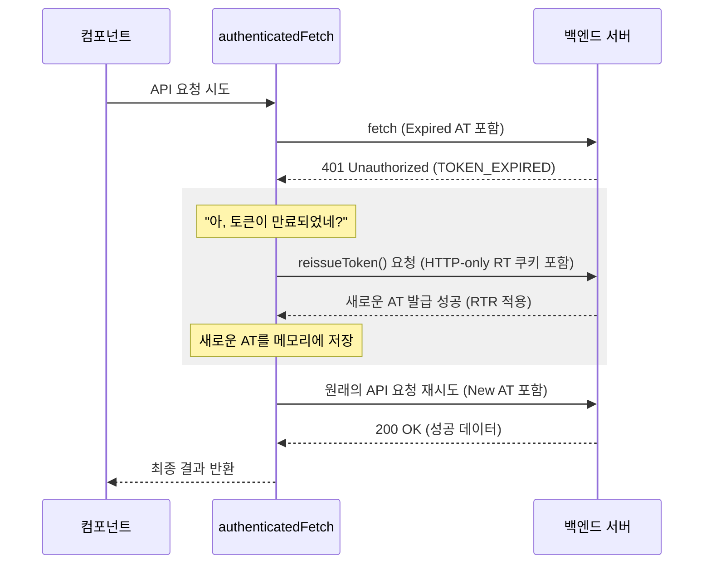

# 인증 시스템 설계 및 구현 (Authentication System Architecture)

이 문서는 Shoemoa 프로젝트에 구현된 JWT 기반 인증 시스템의 상세 설계와 동작 방식을 설명합니다. 보안과 사용자 경험의 균형을 위해 **인메모리 액세스 토큰**과 **HTTP-only 리프레시 토큰** 방식을 채택하고 있습니다.

## 1. 개요 및 정책

Shoemoa는 Stateless한 인증을 위해 JWT(JSON Web Token)를 사용합니다.

### 1.1 토큰 정책

| 항목 | Access Token | Refresh Token |
| :--- | :--- | :--- |
| **용도** | API 요청 인증 | Access Token 재발급 |
| **유효 기간** | 1시간 (3,600,000ms) | 7일 (604,800,000ms) |
| **저장 위치** | 프론트엔드 메모리 (Variable) | HTTP-only 쿠키 & DB |
| **전송 방식** | `Authorization` 헤더 (Bearer) | Cookie |
| **보안 설정** | - | `HttpOnly`, `Secure`, `SameSite=Strict` |

### 1.2 토큰 Payload 정보

*   **Access Token**: `sub`(ID), `email`, `role`(USER/ADMIN), `iat`, `exp`
*   **Refresh Token**: `sub`(ID), `type`: "refresh", `iat`, `exp`

## 2. 인증 프로세스

### 2.1 로그인 (`POST /api/members/login`)
1.  사용자가 이메일/비밀번호로 로그인 요청.
2.  서버 인증 성공 시 Access Token과 Refresh Token 생성.
3.  **RTR (Refresh Token Rotation)**: Refresh Token은 DB(`refresh_tokens` 테이블)에 저장/업데이트됩니다.
4.  Access Token은 **JSON 응답 본문**으로, Refresh Token은 **HTTP-only 쿠키**로 프론트엔드에 전달됩니다.

### 2.2 API 요청 및 권한 검증
1.  프론트엔드는 보호된 리소스 요청 시 `Authorization` 헤더에 `Bearer <AccessToken>`을 포함합니다.
2.  서버의 `JwtAuthenticationFilter`에서 토큰을 검증합니다.
3.  유효한 토큰일 경우 요청을 처리하고, 만료되거나 잘못된 경우 `401 Unauthorized`를 응답합니다.

### 2.3 토큰 재발급 (Silent Refresh / Reissue)
1.  액세스 토큰이 만료되어 서버로부터 `TOKEN_EXPIRED` 에러를 받으면, 프론트엔드는 자동으로 `/api/members/reissue`를 호출합니다.
2.  이때 브라우저는 쿠키에 담긴 Refresh Token을 자동으로 전송합니다.
3.  서버는 쿠키의 토큰을 DB와 대조하여 유효성을 검증합니다.
4.  **검증 성공 시**: 새로운 Access Token(JSON)과 새로운 Refresh Token(Cookie)을 발급하여 RTR을 수행합니다.

## 3. 에러 코드 대응 가이드

백엔드에서 반환하는 인증 관련 에러 코드별 프론트엔드 대응 방식입니다.

| Status | Error Code | Description | Action |
| :--- | :--- | :--- | :--- |
| 401 | `TOKEN_EXPIRED` | Access Token 만료 | `/api/members/reissue` 호출 시도 |
| 401 | `INVALID_TOKEN` | 위변조된 토큰 | 로그아웃 처리 및 재로그인 유도 |
| 401 | `UNAUTHORIZED` | 인증 정보 누락 | 로그인 페이지로 이동 |
| 401 | `MISSING_COOKIE` | Refresh Token 쿠키 없음 | 재로그인 필요 |
| 403 | `FORBIDDEN` | 접근 권한 부족 | 권한 부족 안내 또는 이전 페이지 이동 |

## 4. 프론트엔드 구현 상세 (Next.js)

### 4.1 상태 관리
*   **액세스 토큰**: `lib/auth-storage.ts`를 통해 메모리에 보관하며, XSS 공격으로부터 보호합니다.
*   **사용자 정보**: `email`, `role` 등은 `localStorage`에 저장하여 새로고침 시 세션을 복구하는 힌트로 사용합니다.

### 4.2 API 인터셉터 (`authenticatedFetch`)
`use-auth.tsx`에 구현된 이 함수는 401 에러 감지 시 자동으로 재발급 로직을 수행하고 원래 요청을 재시도합니다.

## 5. 보안 설계 원칙

*   **XSS 방어**: 액세스 토큰은 메모리에, 리프레시 토큰은 `HttpOnly` 쿠키에 저장하여 스크립트 접근을 차단합니다.
*   **CSRF 방어**: 리프레시 토큰 쿠키에 `SameSite=Strict`를 설정하여 외부 사이트에서의 요청 위조를 방지합니다.
*   **RTR (Refresh Token Rotation)**: 재발급 시마다 리프레시 토큰을 교체하여 탈취된 토큰의 재사용을 방지합니다.
*   **DB 연동**: 서버 측 DB에 리프레시 토큰을 관리하여 필요 시 강제 로그아웃 기능을 지원합니다.
